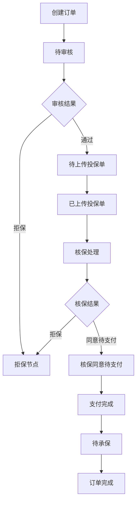
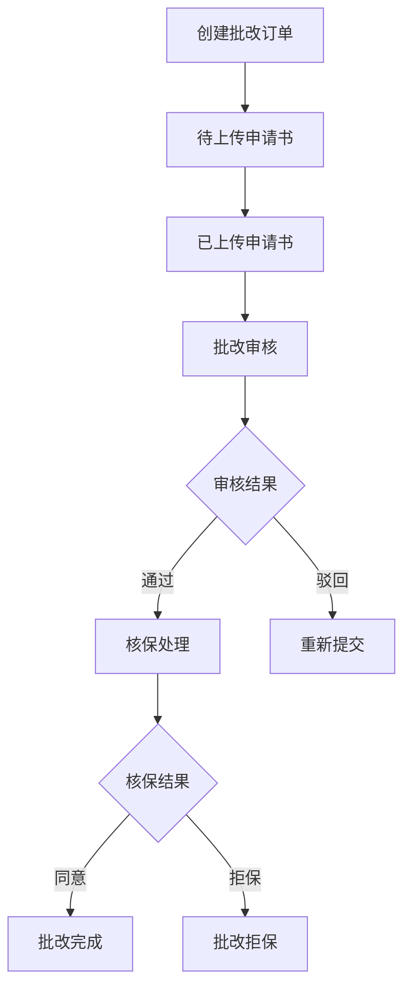
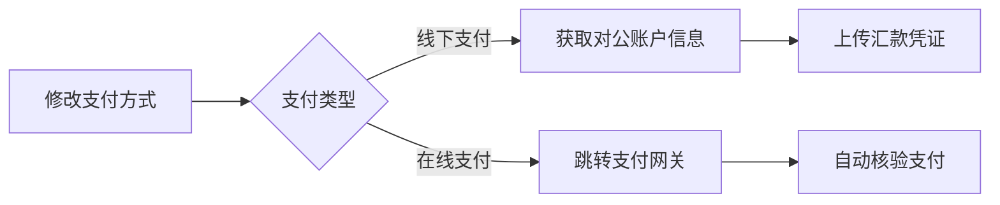
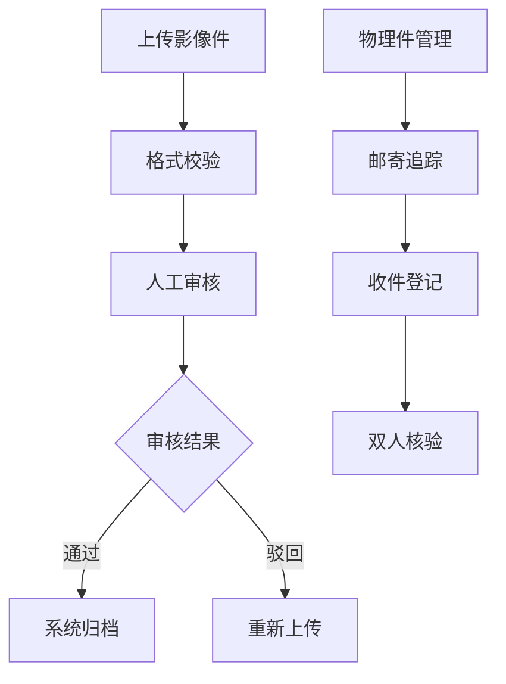

## 工作台界面结构

### 顶部导航区
提供业务切换与返回功能：
- **订单号显示**：当前处理的订单编号
- **功能切换按钮**：
  - 订单：基础投保业务处理
  - 批改：保单变更业务处理
  - 欠缴资料：补充资料管理
  - 返回：返回上一级页面

### 订单状态流程链
直观展示订单处理进度：
- 进度百分比：圆形进度指示器
- 状态节点链：连接各处理环节的流程图
- 时间戳记录：各节点处理时间
- 处理人信息：各节点操作人员

### 订单基本信息区
展示订单核心数据：
- **产品信息**：
  - 产品名称与代码
  - 保险公司名称
  - 产品类型
  - 承保区域
- **投保方信息**：
  - 投保人名称
  - 联系方式
  - 对接人员
- **保障信息**：
  - 保险期间
  - 总保费金额
  - 被保险人数量
  - 佣金比例
- **数据分析**：
  - 职业分布饼图
  - 年龄分布饼图

### 操作功能区
根据订单状态提供相应操作按钮：
- **资料管理**：
  - 上传投保单
  - 上传支付凭证
  - 上传批改申请书
- **订单处理**：
  - 订单详情查看
  - 订单修改
  - 订单撤销
  - 工作记录查询
  - 退保处理

## 订单详情页面

### 详情页导航
提供多个信息标签页：
- 保单信息
- 投保方案
- 人员信息
- 订单资料
- 投保日志

### 保险人信息
展示承保公司详细信息：
- 保险公司名称
- 格式化保单号
- 通知单号码
- 询价单号码
- 申请单号码
- 关联保单号

### 投保人信息
展示投保企业详细资料：
- 公司名称
- 公司地址
- 证件类型与号码
- 公司电话
- 联系人信息
- 联系电话与邮箱

### 被保险人信息
展示被保障对象详情：
- 被保险人名称
- 注册地址
- 证件类型与号码
- 联系方式
- 用工单位
- 银行账户信息
- 行业类型

### 授权指定批改
展示批改授权信息：
- 保险经纪人
- 代理人姓名
- 代理人身份证号

### 开票信息
展示发票相关信息：
- 发票类型
- 发票抬头
- 纳税人识别号
- 企业注册地址
- 企业开户银行
- 企业银行账号

### 人员清单管理
提供被保险人名单管理功能：
- 批量导入/导出
- 人员信息编辑
- 人员分组管理
- 证件信息验证

### 订单资料管理
管理订单相关文件：
- 投保单
- 批改申请书
- 支付凭证
- 保单文件
- 影像件管理

<Note>
工作台界面会根据订单状态动态调整可用操作按钮，确保操作符合业务流程规范。
</Note>

<Warning>
请在操作前确认订单状态，避免重复或无效操作。部分操作可能需要特定权限。
</Warning>

### 快捷操作区
<CardGroup>
  <Card title="订单操作" icon="list-check">
    提供常用业务按钮：
    - 订单详情：查看完整订单信息
    - 工作记录：操作历史与处理记录
    - 退保申请：发起退保流程
    - 保单批改：修改保单信息
  </Card>

  <Card title="资料管理" icon="file-lines">
    支持各类文件操作：
    - 上传投保单：提交电子投保单
    - 上传申请书：提交批改申请材料
    - 影像件管理：查看和管理所有文件
  </Card>
</CardGroup>

### 订单详情展示
系统分区域展示订单信息：
- 基础信息区：
  - 订单编号
  - 订单状态
  - 创建时间
  - 处理进度

- 投保信息区：
  - 投保人信息
  - 被保险人名单
  - 保障期限
  - 保费金额

- 图表分析区：
  - 职业分布饼图
  - 年龄分布饼图
  - 支持数据下钻

<Note>
所有操作按钮根据订单状态动态显示，确保操作符合业务流程。
</Note>

<Warning>
请在操作前确认订单状态，避免重复或无效操作。
</Warning>

### 核心业务流程
#### 1. 新单创建流程

#### 2. 批改业务流程

### 关键状态说明
#### 核心状态节点
- **待审核**：需人工复核投保资料完整性
- **拒保节点**：
  - 显示拒保原因（分公司/SGB > 运营/xDB优先级）
  - 自动生成xDB+日期格式的拒保单号
  - 支持修改订单后重新提交
- **核保同意待支付**：
  - 需在指定时间内完成支付（含线下/在线方式）
  - 支付凭证上传后触发承保流程
- **批改完成**：
  - 自动生成批改单号
  - 更新保单信息并归档变更记录

#### 特殊状态处理
- **订单锁定**：
  - 触发条件：未按时完成欠缴资料
  - 限制：禁止任何批改操作
  - 解决方案：完成资料补传后人工解锁
- **订单撤销**：
  - 允许条件：未进入核保阶段
  - 系统记录撤销原因（用户主动/超时自动）
  - 保留操作日志供审计
- **订单注销**：
  - 需满足无未决赔付案件
  - 从工作台移除，仅存于历史流水
  - 注销后不可恢复

### 业务操作指南
#### 支付管理

- 支付凭证要求：
  - 线下支付：需包含汇款单号+银行回执
  - 在线支付：系统自动关联交易流水号
  - 超时处理：超过24小时未到账需联系客户经理

#### 批改业务规范
1. **标准批改**：
   - 支持人员增减（需保持总人数平衡）
   - 生效时间规则：次日零时生效
   - 保费差额计算：自动生成补退金额

2. **非标批改**：
   - 需上传特约批改申请书
   - 要求附加盖章说明文件
   - 需双重审核（分公司+总部核保）

3. **批量批改**：
   - 支持Excel模板导入
   - 自动校验格式（证件号有效性校验）
   - 生成批量处理流水号

#### 影像件管理

- 文件要求：
  - PDF/JPEG格式，单文件≤5MB
  - 投保单需包含骑缝章
  - 批改申请书需法人亲笔签名

<Note type="tip">
所有状态变更都会实时同步至「操作日志」，可通过订单详情页查看完整处理轨迹
</Note>

<Warning type="important">
1. 担保状态订单需在3个工作日内完成材料补正
2. 物理件邮寄需使用顺丰标快并保留运单凭证
3. 增值税专用发票信息修改需重新走审核流程
</Warning>

<Note type="example">
**典型业务场景**：
某制造企业需减少5名离职员工并新增3名新员工：
1. 创建标准批改订单
2. 上传更新后的参保人员清单
3. 系统自动计算保费差额-¥427.50
4. 完成在线支付补差
5. 生成批单号PJ20231109-003
6. 新方案次日0时生效
</Note>