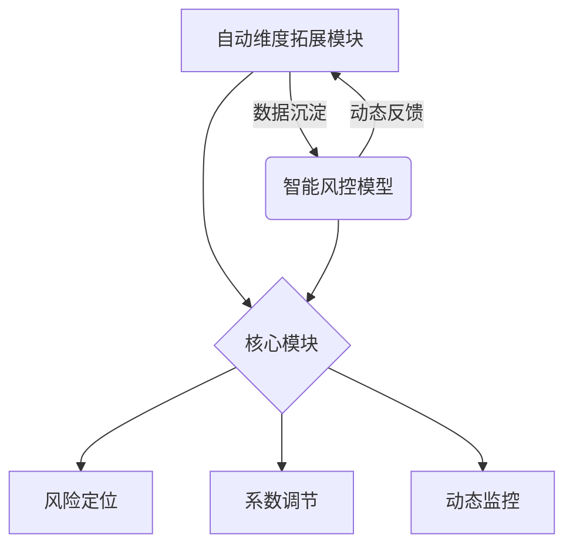
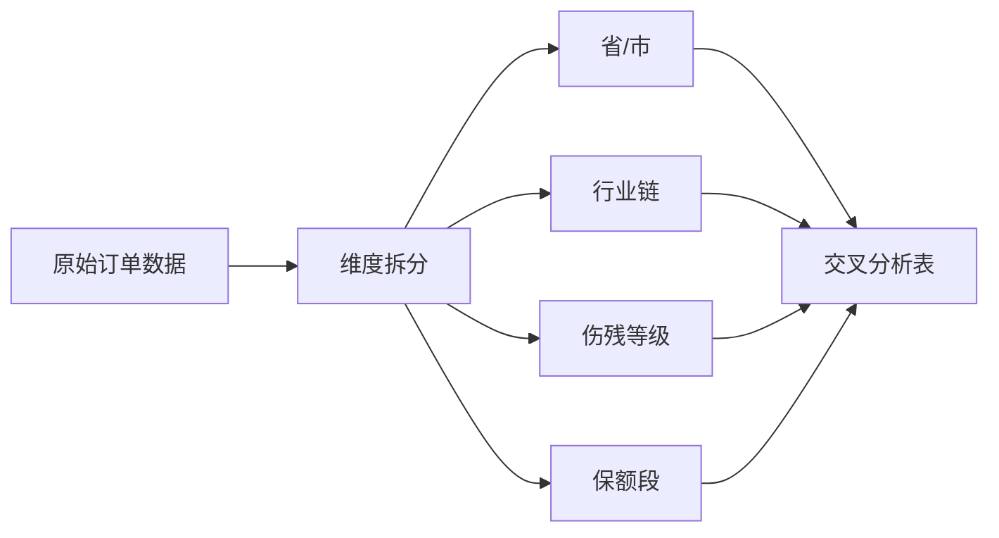
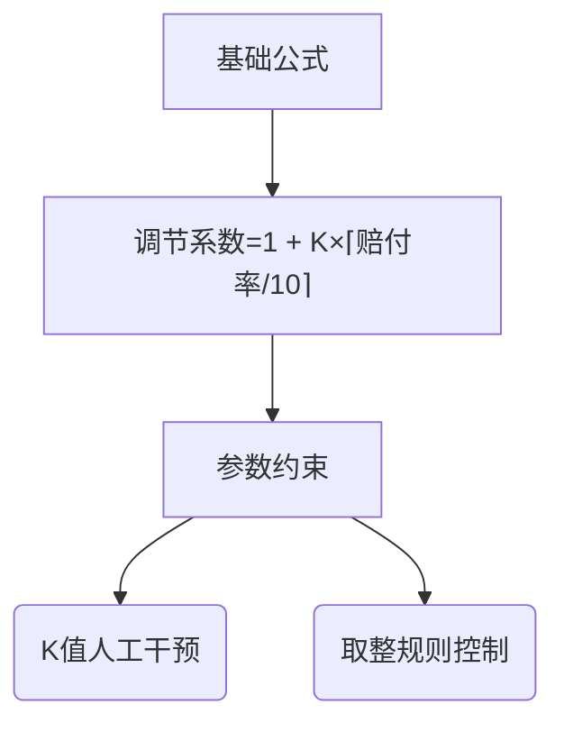
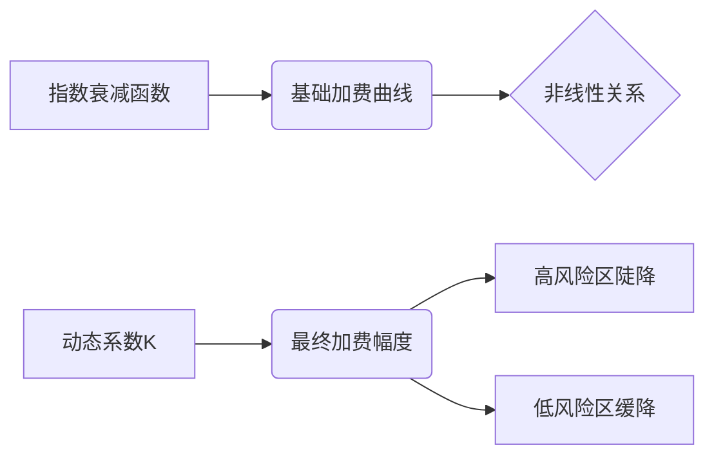

---


## 整体架构图


---

## 第一阶段：自动维度拓展模块

### 1. 数据建模架构


#### 典型交叉维度示例表
| 维度层级 | 示例路径 | 数据量级 |
|----------|----------|----------|
| 四级交叉 | 江苏省 ▶ 无锡市 ▶ C0419制造业 ▶ 十级伤残 | 1200单 |
| 三级交叉 | 广东省 ▶ 保额50万+ ▶ 行业赔付TOP10 | 890单 |
| 二级交叉 | 浙江省 ▶ 七级伤残 | 15,000单 |

### 2. 风险定位机制
**筛选逻辑流程**：
```
赔付率计算 → 阈值比对 → 条件树生成 → 风险评级
```

#### 五级风险评级标准
| 风险等级 | 赔付率区间 | 调节系数范围 | 典型案例 |
|----------|------------|--------------|----------|
| 正常 | ＜80% | 1.0x | 上海市-金融业 |
| 关注 | 80%-100% | 1.0-1.2x | 杭州市-物流业 |
| 预警 | 100%-150% | 1.2-1.5x | 佛山市-陶瓷制造 |
| 高危 | 150%-200% | 1.5-2.0x | 徐州市-煤矿开采 |
| 禁入 | >200% | 暂停承保 | 特定高危行业 |

### 3. 人工调节系数算法（在第二阶段不适用）


#### 调节效果对照表
| 原赔付率 | K=0.5 | K=0.8 | K=1.0 |
|----------|-------|-------|-------|
| 85%      | 1.05  | 1.08  | 1.10  |
| 120%     | 1.10  | 1.16  | 1.20  |
| 180%     | 1.15  | 1.22  | 1.30  |

---

## 第二阶段：智能风控模型

### 1. 风险评估矩阵
#### 风险评分算法
**公式结构**：
```math
风险评分(S) = 100 - \left( \alpha \times 赔付率 + \beta \times 占比校准 + \gamma \times 出险率 + \delta \times 人均赔款_{归一化} \right) \times 100
```
**参数权重分配**：
| 参数符号 | 指标类型       | 权重系数 | 计算规则                |
|----------|----------------|----------|-------------------------|
| α        | 赔付率         | 70%      | 累计赔付金额/已赚保费          |
| β        | 行业占比校准   | 20%      | 行业平均占比/实际占比   |
| γ        | 出险率         | 5%       | 报案量/有效保单量       |
| δ        | 人均赔款       | 5%       | 对数归一化处理          |

**评分示例表**：
| 赔付率 | 行业占比校准 | 出险率 | 人均赔款 | 风险评分 |
|--------|--------------|--------|----------|----------|
| 120%   | 1.3          | 8%     | 5.6万    | 36分     |
| 85%    | 0.9          | 5%     | 3.2万    | 72分     |
| 200%   | 2.1          | 15%    | 12.8万   | 5分      |

#### risk_assessment模块
程序运行后，将：
- **自动加载最新的订单数据** (`data_files/order_data_YYYYMMDD.csv`)
- **自动加载行业分类 JSON** (`config/国民行业分类_2017.json`)
- **计算行业和地区的风险评分**
- **生成 Excel 文件 `评分结果.xlsx`**

---

#### 订单数据 (`order_data_YYYYMMDD.csv`)或读预存赔付取数据库获得
必须包含以下字段：
字段名         说明
省份           订单所属省份
城市           订单所属城市
行业           订单所属行业（行业代码）
累计赔付金额   该行业/地区的累计赔付金额
已赚保费       该行业/地区的已赚保费
报案数量       该行业/地区的报案数量
最终承保人数   该行业/地区的最终承保人数

示例数据：
上海,上海市,A0111,10000,50000,2,200
北京,北京市,A0123,5000,20000,1,100
广东省,深圳市,A0152,20000,100000,3,300

---

### 2.计算逻辑

#### 行业分层级评分 (示例)
- 加载行业分类 JSON，递归解析为 **一级行业、二级行业、三级行业、四级行业** 结构；
- 依据行业代码，对订单数据进行分层聚合，计算行业内的：
  - 累计赔付金额
  - 已赚保费
  - 报案数量
  - 最终承保人数
  - 赔付率
  - 出险率
  - 人均赔款
  - 占比校准
  - 人均赔款归一化
  - 风险评分
- 计算占比校准、人均赔款归一化、风险评分
- 评分规则：
  - **风险评分 = (100 - 评分公式)**，范围为 0-100，评分越高代表风险越低
  - **若所有数据项（累计赔付金额、已赚保费、报案数量、最终承保人数）均为 0，则风险评分输出为 "/"**
  - **排序：按 JSON 结构顺序排序**

示例输出（Sheet1：行业分层级评分）：
一级行业  二级行业  三级行业  四级行业  赔付率   出险率  人均赔款  风险评分
A        农、林、牧、渔业                    2.66%  4.35%  1150.81  70.77
A01      农业                              7.68%  3.57%  4505.35  59.32
A01      农业      A011  谷物种植          0%     0%     0        100
A01      农业      A011  稻谷种植          0%     0%     0        100

---

#### 地区分层级评分 (示例)
- 计算省级汇总（"城市" 为空），其后按城市进行分组
- 计算行业内的：
  - 累计赔付金额
  - 已赚保费
  - 报案数量
  - 最终承保人数
  - 赔付率
  - 出险率
  - 人均赔款
  - 占比校准
  - 人均赔款归一化
  - 风险评分
- 省级数据排在城市数据前
- 评分规则：
  - **风险评分 = (100 - 评分公式)**，范围为 0-100，评分越高代表风险越低
  - **若所有数据项（累计赔付金额、已赚保费、报案数量、最终承保人数）均为 0，则风险评分输出为 "/"**
  - **排序：省级数据先于城市数据**

示例输出（Sheet2：地区分层级评分）：
省份    城市   赔付率   出险率  人均赔款  风险评分
北京         0.57%  0.76%  153.81  59.32
北京   北京市  0.57%  0.76%  153.81  59.32
上海         0.39%  1.93%  284.85  70.77
上海   上海市  0.39%  1.93%  284.85  70.77

---

### 3. 示例代码
```python
# python risk_assessment.py
import os
import pandas as pd
import numpy as np
import json
import chardet

# ---------------------------
# 日志记录函数
# ---------------------------
def log_message(message):
    print(f"[LOG] {message}")

# ---------------------------
# 检测文件编码函数
# ---------------------------
def detect_encoding(file_path):
    with open(file_path, 'rb') as f:
        result = chardet.detect(f.read())
    return result['encoding']

# ---------------------------
# 查找最新订单数据文件（从 data_files 目录中查找以 "order_data" 开头的文件）
# ---------------------------
def find_latest_order_data():
    directory = "data_files"
    files = [f for f in os.listdir(directory) if f.startswith("order_data")]
    if not files:
        raise FileNotFoundError("未找到匹配的数据文件")
    file_name = max(files, key=lambda x: os.path.getctime(os.path.join(directory, x)))
    file_path = os.path.join(directory, file_name)
    log_message(f"加载最新订单数据文件: {file_path}")
    return file_name, file_path

# ---------------------------
# 加载最新订单数据，返回 DataFrame
# ---------------------------
def load_order_data():
    _, order_data_path = find_latest_order_data()
    encoding = detect_encoding(order_data_path)
    df = pd.read_csv(order_data_path, encoding=encoding)
    df.columns = df.columns.str.strip()
    log_message("订单数据加载完成。")
    return df

# ---------------------------
# 自动查找 JSON 文件（行业分类 JSON 文件）
# ---------------------------
def find_latest_json():
    json_files = [f for f in os.listdir() if f.endswith(".json") and "国民行业分类" in f]
    if not json_files:
        raise FileNotFoundError("未找到匹配的行业分类 JSON 文件")
    latest_json = max(json_files, key=lambda x: os.path.getctime(x))
    log_message(f"加载行业分类文件: {latest_json}")
    return latest_json

# ---------------------------
# 递归展开 JSON 结构，生成节点的层级信息
# 返回的每个字典包含：一级行业、二级行业、三级行业、四级行业（不足4级则空字符串）及当前节点代码（node_code）
# ---------------------------
def flatten_json_levels(data, parent_levels=None, print_count=0, all_data=None):
    if parent_levels is None:
        parent_levels = []
    if all_data is None:
        all_data = data
    
    # 创建一个函数来递归查找指定代码的行业名称
    def find_industry_name(code, data_list):
        for item in data_list:
            if item["code"] == code:
                return item["name"]
            if "children" in item and item["children"]:
                result = find_industry_name(code, item["children"])
                if result:
                    return result
        return None
    
    rows = []
    for item in data:
        code = item["code"]
        name = item["name"]
        current = f"{code}|{name}"
        
        if len(code) == 1:  # A, B, C...
            level = 1
            row = {
                "一级行业": current,
                "二级行业": "",
                "三级行业": "",
                "四级行业": ""
            }
        elif len(code) == 3:  # A01, B02...
            level = 2
            parent_code = code[0]
            parent_name = find_industry_name(parent_code, all_data)
            row = {
                "一级行业": f"{parent_code}|{parent_name}",
                "二级行业": current,
                "三级行业": "",
                "四级行业": ""
            }
        elif len(code) == 4:  # A011, B021...
            level = 3
            parent_code_1 = code[0]
            parent_code_2 = code[:3]
            parent_name_1 = find_industry_name(parent_code_1, all_data)
            parent_name_2 = find_industry_name(parent_code_2, all_data)
            row = {
                "一级行业": f"{parent_code_1}|{parent_name_1}",
                "二级行业": f"{parent_code_2}|{parent_name_2}",
                "三级行业": current,
                "四级行业": ""
            }
        elif len(code) == 5:  # A0111, B0211...
            level = 4
            parent_code_1 = code[0]
            parent_code_2 = code[:3]
            parent_code_3 = code[:4]
            parent_name_1 = find_industry_name(parent_code_1, all_data)
            parent_name_2 = find_industry_name(parent_code_2, all_data)
            parent_name_3 = find_industry_name(parent_code_3, all_data)
            row = {
                "一级行业": f"{parent_code_1}|{parent_name_1}",
                "二级行业": f"{parent_code_2}|{parent_name_2}",
                "三级行业": f"{parent_code_3}|{parent_name_3}",
                "四级行业": current
            }
        else:
            continue  # 跳过不符合规则的代码
        
        # 创建当前层级的完整路径
        current_levels = parent_levels + [current]
        
        # 只打印前5条数据
        if print_count < 5:
            print(f"\n当前处理节点: {current}")
            print(f"当前层级: {level}")
            print(f"完整路径: {current_levels}")
            print_count += 1
        
        row["node_code"] = code
        row["node_level"] = level
        rows.append(row)
        
        # 递归处理子节点
        if "children" in item and item["children"]:
            child_rows, print_count = flatten_json_levels(item["children"], current_levels, print_count, all_data)
            rows.extend(child_rows)
    
    return rows, print_count

# 在load_industry_nodes函数中修改调用方式
def load_industry_nodes():
    json_file = find_latest_json()
    with open(json_file, "r", encoding="utf-8") as f:
        industry_json = json.load(f)
    
    # 展开JSON结构，传入完整的行业数据
    nodes, _ = flatten_json_levels(industry_json, all_data=industry_json)
    df_nodes = pd.DataFrame(nodes)
    
    # 添加排序列，但不重新计算node_level
    df_nodes["order"] = range(len(df_nodes))
    
    # 确保node_level列存在且正确
    if "node_level" not in df_nodes.columns:
        df_nodes["node_level"] = df_nodes.apply(
            lambda row: sum(1 for col in ["一级行业", "二级行业", "三级行业", "四级行业"] 
                          if pd.notna(row[col]) and row[col] != ""), 
            axis=1
        )
    
    # 在返回前打印前几行数据进行调试
    print("\n前5行节点数据:")
    print(df_nodes[["一级行业", "二级行业", "三级行业", "四级行业", "node_level"]].head(5))
    
    log_message("行业分类节点加载完成。")
    return df_nodes

# ---------------------------
# 根据节点的代码前缀聚合订单数据（行业模块用）
# ---------------------------
def aggregate_node_data(order_df, node_code):
    subset = order_df[order_df["行业"].str.startswith(node_code)]
    agg = {}
    agg["累计赔付金额"] = subset["累计赔付金额"].sum() if not subset.empty else 0
    agg["已赚保费"] = subset["已赚保费"].sum() if not subset.empty else 0
    agg["报案数量"] = subset["报案数量"].sum() if not subset.empty else 0
    agg["最终承保人数"] = subset["最终承保人数"].sum() if not subset.empty else 0
    agg["赔付率"] = agg["累计赔付金额"] / agg["已赚保费"] if agg["已赚保费"] > 0 else 0
    agg["出险率"] = agg["报案数量"] / agg["最终承保人数"] if agg["最终承保人数"] > 0 else 0
    agg["人均赔款"] = agg["累计赔付金额"] / agg["最终承保人数"] if agg["最终承保人数"] > 0 else 0
    return agg

# ---------------------------
# 针对同一层级内的节点计算占比校准、人均赔款归一化及风险评分
# 若累计赔付金额、已赚保费、报案数量和最终承保人数全为0，则风险评分输出为 "/"
# ---------------------------
def compute_risk_for_level(df_level):
    total_premium = df_level["已赚保费"].sum()
    max_avg_payout = df_level["人均赔款"].max() if not df_level.empty else 0
    df_level["占比校准"] = np.where(total_premium > 0, df_level["已赚保费"] / total_premium, 0)
    df_level["人均赔款归一化"] = np.where(max_avg_payout > 0, df_level["人均赔款"] / max_avg_payout, 0)
    alpha, beta, gamma, delta = 0.7, 0.2, 0.05, 0.05
    raw_score = (alpha * df_level["赔付率"] +
                 beta * df_level["占比校准"] +
                 gamma * df_level["出险率"] +
                 delta * df_level["人均赔款归一化"]) * 100
    # 将风险评分列转换为object以便存入"/"
    df_level["风险评分"] = (100 - raw_score).clip(lower=0).round(2).astype(object)
    condition = (
        (df_level["累计赔付金额"] == 0) &
        (df_level["已赚保费"] == 0) &
        (df_level["报案数量"] == 0) &
        (df_level["最终承保人数"] == 0)
    )
    df_level.loc[condition, "风险评分"] = "/"
    return df_level


# ---------------------------
# 行业评分模块：加载行业 JSON、合并订单数据、计算行业分层级风险评分
# ---------------------------
def industry_scoring_module(order_df):
    nodes_df = load_industry_nodes()
    agg_list = []
    
    # 遍历每个节点，保留原始层级信息
    for idx, node in nodes_df.iterrows():
        node_code = node["node_code"]
        node_level = node["node_level"]
        
        # 聚合该节点的订单数据
        agg = aggregate_node_data(order_df, node_code)
        
        # 直接使用nodes_df中的行业层级信息，不再重新设置
        agg["一级行业"] = node["一级行业"]
        agg["二级行业"] = node["二级行业"]
        agg["三级行业"] = node["三级行业"]
        agg["四级行业"] = node["四级行业"]
        agg["node_level"] = node["node_level"]
        agg["node_code"] = node["node_code"]
        agg["order"] = node["order"]
        agg_list.append(agg)
    
    df_agg = pd.DataFrame(agg_list)
    level_list = []
    for level in sorted(df_agg["node_level"].unique()):
        df_level = df_agg[df_agg["node_level"] == level].copy()
        df_level = compute_risk_for_level(df_level)
        level_list.append(df_level)
    df_final = pd.concat(level_list, axis=0)
    df_final.sort_values(by="order", inplace=True)
    final_cols = ["一级行业", "二级行业", "三级行业", "四级行业",
                  "累计赔付金额", "已赚保费", "报案数量", "最终承保人数",
                  "赔付率", "出险率", "人均赔款",
                  "占比校准", "人均赔款归一化", "风险评分",
                  "node_level", "node_code", "order"]
    df_final = df_final[final_cols]
    return df_final

# ---------------------------
# 地区评分模块：对订单数据中的"省份"和"城市"进行汇总
# 同时输出省级汇总（"城市"字段保留为空）和城市明细
# ---------------------------
def compute_area_scores(order_df):
    # 城市明细：按 ["省份", "城市"] 分组
    df_city = order_df.groupby(["省份", "城市"]).agg({
        "累计赔付金额": "sum",
        "已赚保费": "sum",
        "报案数量": "sum",
        "最终承保人数": "sum"
    }).reset_index()
    df_city["赔付率"] = np.where(df_city["已赚保费"] > 0,
                                  df_city["累计赔付金额"] / df_city["已赚保费"], 0)
    df_city["出险率"] = np.where(df_city["最终承保人数"] > 0,
                                 df_city["报案数量"] / df_city["最终承保人数"], 0)
    df_city["人均赔款"] = np.where(df_city["最终承保人数"] > 0,
                                   df_city["累计赔付金额"] / df_city["最终承保人数"], 0)
    total_premium_city = df_city["已赚保费"].sum()
    max_avg_payout_city = df_city["人均赔款"].max() if not df_city.empty else 0
    df_city["占比校准"] = np.where(total_premium_city > 0, df_city["已赚保费"] / total_premium_city, 0)
    df_city["人均赔款归一化"] = np.where(max_avg_payout_city > 0, df_city["人均赔款"] / max_avg_payout_city, 0)
    alpha, beta, gamma, delta = 0.7, 0.2, 0.05, 0.05
    raw_score_city = (alpha * df_city["赔付率"] +
                      beta * df_city["占比校准"] +
                      gamma * df_city["出险率"] +
                      delta * df_city["人均赔款归一化"]) * 100
    df_city["风险评分"] = (100 - raw_score_city).clip(lower=0).round(2).astype(object)
    cond_city = ((df_city["累计赔付金额"] == 0) &
                 (df_city["已赚保费"] == 0) &
                 (df_city["报案数量"] == 0) &
                 (df_city["最终承保人数"] == 0))
    df_city.loc[cond_city, "风险评分"] = "/"
    
    # 省级汇总：按 "省份" 分组
    df_prov = order_df.groupby("省份").agg({
        "累计赔付金额": "sum",
        "已赚保费": "sum",
        "报案数量": "sum",
        "最终承保人数": "sum"
    }).reset_index()
    df_prov["城市"] = ""  # 省级汇总，城市为空
    df_prov["赔付率"] = np.where(df_prov["已赚保费"] > 0,
                                  df_prov["累计赔付金额"] / df_prov["已赚保费"], 0)
    df_prov["出险率"] = np.where(df_prov["最终承保人数"] > 0,
                                 df_prov["报案数量"] / df_prov["最终承保人数"], 0)
    df_prov["人均赔款"] = np.where(df_prov["最终承保人数"] > 0,
                                   df_prov["累计赔付金额"] / df_prov["最终承保人数"], 0)
    total_premium_prov = df_prov["已赚保费"].sum()
    max_avg_payout_prov = df_prov["人均赔款"].max() if not df_prov.empty else 0
    df_prov["占比校准"] = np.where(total_premium_prov > 0, df_prov["已赚保费"] / total_premium_prov, 0)
    df_prov["人均赔款归一化"] = np.where(max_avg_payout_prov > 0, df_prov["人均赔款"] / max_avg_payout_prov, 0)
    raw_score_prov = (alpha * df_prov["赔付率"] +
                      beta * df_prov["占比校准"] +
                      gamma * df_prov["出险率"] +
                      delta * df_prov["人均赔款归一化"]) * 100
    df_prov["风险评分"] = (100 - raw_score_prov).clip(lower=0).round(2).astype(object)
    cond_prov = ((df_prov["累计赔付金额"] == 0) &
                 (df_prov["已赚保费"] == 0) &
                 (df_prov["报案数量"] == 0) &
                 (df_prov["最终承保人数"] == 0))
    df_prov.loc[cond_prov, "风险评分"] = "/"
    
    # 合并省级和城市级数据；保持两部分的列顺序一致
    df_area = pd.concat([df_prov, df_city], axis=0, ignore_index=True)
    # 为了排序，新增一个临时排序列，省级（城市为空）排序值设为0，否则设为1
    df_area["city_sort"] = df_area["城市"].apply(lambda x: 0 if x == "" else 1)
    df_area = df_area.sort_values(by=["省份", "city_sort", "城市"])
    df_area.drop(columns=["city_sort"], inplace=True)
    
    # 调整输出列顺序
    final_cols = ["省份", "城市", "累计赔付金额", "已赚保费", "报案数量", "最终承保人数",
                  "赔付率", "出险率", "人均赔款", "占比校准", "人均赔款归一化", "风险评分"]
    df_area = df_area[final_cols]
    return df_area


# ---------------------------
# 行业城市交叉分析模块：将行业分析与城市分析结合，生成每个城市下的行业风险评分
# ---------------------------
def compute_industry_area_cross(order_df, industry_df):
    # 不要直接使用load_industry_nodes()，而是使用传入的industry_df
    # 这样可以保持与行业分层级评分模块一致的数据格式
    
    # 获取所有省份和城市组合
    province_city_pairs = order_df[["省份", "城市"]].drop_duplicates()

    # 存储结果的列表
    cross_results = []
    
    # 先处理省级数据
    for province in order_df["省份"].unique():
        # 获取该省份的订单数据
        province_df = order_df[order_df["省份"] == province]
        
        # 对每个行业节点进行处理 - 使用industry_df而不是nodes_df
        for _, node in industry_df.iterrows():
            node_code = node["node_code"]
            
            # 筛选该省份下属于该行业的订单
            subset = province_df[province_df["行业"].str.startswith(node_code)]
            
            # 如果没有数据，跳过该行业
            if subset.empty:
                continue
            
            # 计算该省份该行业的汇总指标 - 直接使用industry_df中的行业信息
            agg = {
                "省份": province,
                "城市": "",  # 省级汇总数据城市列为空
                "一级行业": node["一级行业"],
                "二级行业": node["二级行业"],
                "三级行业": node["三级行业"],
                "四级行业": node["四级行业"],
                "node_code": node["node_code"],
                "累计赔付金额": subset["累计赔付金额"].sum(),
                "已赚保费": subset["已赚保费"].sum(),
                "报案数量": subset["报案数量"].sum(),
                "最终承保人数": subset["最终承保人数"].sum()
            }
            
            # 计算衍生指标
            agg["赔付率"] = agg["累计赔付金额"] / agg["已赚保费"] if agg["已赚保费"] > 0 else 0
            agg["出险率"] = agg["报案数量"] / agg["最终承保人数"] if agg["最终承保人数"] > 0 else 0
            agg["人均赔款"] = agg["累计赔付金额"] / agg["最终承保人数"] if agg["最终承保人数"] > 0 else 0
            
            cross_results.append(agg)
    
    # 再处理城市级数据
    for _, row in province_city_pairs.iterrows():
        province = row["省份"]
        city = row["城市"]
        
        # 获取该城市的订单数据
        city_df = order_df[(order_df["省份"] == province) & (order_df["城市"] == city)]
        
        # 对每个行业节点进行处理 - 使用industry_df而不是nodes_df
        for _, node in industry_df.iterrows():
            node_code = node["node_code"]
            
            # 筛选该城市下属于该行业的订单
            subset = city_df[city_df["行业"].str.startswith(node_code)]
            
            # 如果没有数据，跳过该行业
            if subset.empty:
                continue
            
            # 计算该城市该行业的汇总指标
            agg = {
                "省份": province,
                "城市": city,
                "一级行业": node["一级行业"],
                "二级行业": node["二级行业"],
                "三级行业": node["三级行业"],
                "四级行业": node["四级行业"],
                "node_code": node["node_code"],  # 添加 node_code
                "累计赔付金额": subset["累计赔付金额"].sum(),
                "已赚保费": subset["已赚保费"].sum(),
                "报案数量": subset["报案数量"].sum(),
                "最终承保人数": subset["最终承保人数"].sum()
            }
            
            # 计算衍生指标
            agg["赔付率"] = agg["累计赔付金额"] / agg["已赚保费"] if agg["已赚保费"] > 0 else 0
            agg["出险率"] = agg["报案数量"] / agg["最终承保人数"] if agg["最终承保人数"] > 0 else 0
            agg["人均赔款"] = agg["累计赔付金额"] / agg["最终承保人数"] if agg["最终承保人数"] > 0 else 0
            
            cross_results.append(agg)
    
    # 转换为DataFrame
    df_cross = pd.DataFrame(cross_results)
    
    # 按省份、城市和行业层级分组计算风险评分
    df_cross = compute_risk_for_level(df_cross)
    
    # 为了排序，新增一个临时排序列，省级（城市为空）排序值设为0，否则设为1
    df_cross["city_sort"] = df_cross["城市"].apply(lambda x: 0 if x == "" else 1)
    
    # 按省份、城市排序和行业代码排序
    df_cross = df_cross.sort_values(by=["省份", "city_sort", "城市", "node_code"])
    
    # 删除临时排序列
    df_cross.drop(columns=["city_sort"], inplace=True)
    
    # 调整输出列顺序
    final_cols = ["省份", "城市", "一级行业", "二级行业", "三级行业", "四级行业",
                  "累计赔付金额", "已赚保费", "报案数量", "最终承保人数",
                  "赔付率", "出险率", "人均赔款", "占比校准", "人均赔款归一化", "风险评分"]
    
    df_cross = df_cross[final_cols]
    return df_cross


# ---------------------------
# 一级行业城市交叉分析模块：基于行业城市交叉分析，只保留一级行业数据
# ---------------------------
def compute_primary_industry_city_cross(city_cross_df):
    # 筛选出一级行业数据（二级行业为空或为空字符串的数据即为一级行业数据）
    primary_industry_df = city_cross_df[
        (city_cross_df["二级行业"].isna()) | 
        (city_cross_df["二级行业"] == "") |
        (city_cross_df["二级行业"].str.strip() == "")
    ].copy()
    
    # 按省份、城市和一级行业排序
    primary_industry_df = primary_industry_df.sort_values(by=["省份", "城市", "一级行业"])
    
    # 确保数据不为空
    if primary_industry_df.empty:
        log_message("警告：未找到一级行业数据")
    else:
        log_message(f"找到 {len(primary_industry_df)} 条一级行业数据")
    
    return primary_industry_df

# ---------------------------
# 地区伤残比例分析模块：统计各地区不同伤残等级的风险评分
# ---------------------------
def compute_disability_area_scores(order_df):
    # 获取所有省份和城市组合
    province_city_pairs = order_df[["省份", "城市"]].drop_duplicates()
    
    # 定义需要分析的伤残等级
    disability_levels = ["十级伤残:3%", "十级伤残:5%", "十级伤残:10%"]
    
    # 存储结果的列表
    results = []
    
    # 获取所有省份列表
    provinces = order_df["省份"].unique()
    
    # 先处理省级数据
    for province in provinces:
        # 获取该省份的订单数据
        province_df = order_df[order_df["省份"] == province]
        
        # 对每个伤残等级进行处理
        for disability in ["十级伤残:3%", "十级伤残:5%", "十级伤残:10%"]:
            # 筛选该伤残等级的订单
            subset = province_df[province_df["伤残"] == disability]
            
            # 计算该省份该伤残等级的汇总指标
            agg = {
                "省份": province,
                "城市": "",  # 省级汇总数据城市列为空
                "伤残": disability,
                "累计赔付金额": subset["累计赔付金额"].sum() if not subset.empty else 0,
                "已赚保费": subset["已赚保费"].sum() if not subset.empty else 0,
                "报案数量": subset["报案数量"].sum() if not subset.empty else 0,
                "最终承保人数": subset["最终承保人数"].sum() if not subset.empty else 0
            }
            
            # 计算衍生指标
            agg["赔付率"] = agg["累计赔付金额"] / agg["已赚保费"] if agg["已赚保费"] > 0 else 0
            agg["出险率"] = agg["报案数量"] / agg["最终承保人数"] if agg["最终承保人数"] > 0 else 0
            agg["人均赔款"] = agg["累计赔付金额"] / agg["最终承保人数"] if agg["最终承保人数"] > 0 else 0
            
            results.append(agg)
    
    # 再处理城市级数据
    
    # 对每个地区进行处理
    for _, row in province_city_pairs.iterrows():
        province = row["省份"]
        city = row["城市"]
        
        # 获取该城市的订单数据
        city_df = order_df[(order_df["省份"] == province) & (order_df["城市"] == city)]
        
        # 对每个伤残等级进行处理
        for disability in disability_levels:
            # 筛选该伤残等级的订单
            subset = city_df[city_df["伤残"] == disability]
            
            # 如果没有数据，添加空记录
            if subset.empty:
                agg = {
                    "省份": province,
                    "城市": city,
                    "伤残": disability,
                    "累计赔付金额": 0,
                    "已赚保费": 0,
                    "报案数量": 0,
                    "最终承保人数": 0,
                    "赔付率": 0,
                    "出险率": 0,
                    "人均赔款": 0,
                    "占比校准": 0,
                    "人均赔款归一化": 0,
                    "风险评分": "/"
                }
            else:
                # 计算基础指标
                agg = {
                    "省份": province,
                    "城市": city,
                    "伤残": disability,
                    "累计赔付金额": subset["累计赔付金额"].sum(),
                    "已赚保费": subset["已赚保费"].sum(),
                    "报案数量": subset["报案数量"].sum(),
                    "最终承保人数": subset["最终承保人数"].sum()
                }
                
                # 计算衍生指标
                agg["赔付率"] = agg["累计赔付金额"] / agg["已赚保费"] if agg["已赚保费"] > 0 else 0
                agg["出险率"] = agg["报案数量"] / agg["最终承保人数"] if agg["最终承保人数"] > 0 else 0
                agg["人均赔款"] = agg["累计赔付金额"] / agg["最终承保人数"] if agg["最终承保人数"] > 0 else 0
            
            results.append(agg)
    
    # 转换为DataFrame
    df_disability = pd.DataFrame(results)
    
    # 按城市和伤残等级分组计算风险评分
    city_disability_groups = []
    
    # 对每个城市的伤残等级单独计算风险评分
    for province in df_disability["省份"].unique():
        province_data = df_disability[df_disability["省份"] == province]
        
        for city in province_data["城市"].unique():
            city_data = province_data[province_data["城市"] == city].copy()
            
            # 计算该城市内的占比校准和人均赔款归一化
            total_premium = city_data["已赚保费"].sum()
            max_avg_payout = city_data["人均赔款"].max() if not city_data.empty else 0
            
            city_data["占比校准"] = np.where(total_premium > 0, city_data["已赚保费"] / total_premium, 0)
            city_data["人均赔款归一化"] = np.where(max_avg_payout > 0, city_data["人均赔款"] / max_avg_payout, 0)
            
            # 计算风险评分
            alpha, beta, gamma, delta = 0.7, 0.2, 0.05, 0.05
            raw_score = (alpha * city_data["赔付率"] +
                        beta * city_data["占比校准"] +
                        gamma * city_data["出险率"] +
                        delta * city_data["人均赔款归一化"]) * 100
            
            city_data["风险评分"] = (100 - raw_score).clip(lower=0).round(2).astype(object)
            
            # 处理无数据情况
            condition = (
                (city_data["累计赔付金额"] == 0) &
                (city_data["已赚保费"] == 0) &
                (city_data["报案数量"] == 0) &
                (city_data["最终承保人数"] == 0)
            )
            city_data.loc[condition, "风险评分"] = "/"
            
            city_disability_groups.append(city_data)
    
    # 合并所有分组结果
    df_final = pd.concat(city_disability_groups, axis=0)
    
    # 按省份、城市和伤残等级排序
    df_final = df_final.sort_values(by=["省份", "城市", "伤残"])
    
    # 调整输出列顺序
    final_cols = ["省份", "城市", "伤残",
                 "累计赔付金额", "已赚保费", "报案数量", "最终承保人数",
                 "赔付率", "出险率", "人均赔款", "占比校准", "人均赔款归一化", "风险评分"]
    
    df_final = df_final[final_cols]
    return df_final

# ---------------------------
# 地区保额分析模块：统计各地区不同保额的风险评分
# ---------------------------
def compute_amount_area_scores(order_df):
    # 获取所有省份和城市组合
    province_city_pairs = order_df[["省份", "城市"]].drop_duplicates()
    
    # 定义需要分析的保额等级（从低到高排序，100000到1000000，步长100000）
    amount_levels = list(range(100000, 1000001, 100000))
    
    # 存储结果的列表
    results = []
    
    # 先处理省级数据
    for province in order_df["省份"].unique():
        # 获取该省份的订单数据
        province_df = order_df[order_df["省份"] == province]
        
        # 获取该省份实际存在的保额等级
        existing_amounts = province_df["保额"].unique()
        
        # 对每个保额等级进行处理
        for amount in amount_levels:
            # 只处理实际存在的保额等级
            if amount in existing_amounts:
                # 筛选该保额等级的订单
                subset = province_df[province_df["保额"] == amount]
                
                # 计算该省份该保额等级的汇总指标
                agg = {
                    "省份": province,
                    "城市": "",  # 省级汇总数据城市列为空
                    "保额": amount,
                    "累计赔付金额": subset["累计赔付金额"].sum(),
                    "已赚保费": subset["已赚保费"].sum(),
                    "报案数量": subset["报案数量"].sum(),
                    "最终承保人数": subset["最终承保人数"].sum()
                }
                
                # 计算衍生指标
                agg["赔付率"] = agg["累计赔付金额"] / agg["已赚保费"] if agg["已赚保费"] > 0 else 0
                agg["出险率"] = agg["报案数量"] / agg["最终承保人数"] if agg["最终承保人数"] > 0 else 0
                agg["人均赔款"] = agg["累计赔付金额"] / agg["最终承保人数"] if agg["最终承保人数"] > 0 else 0
                
                results.append(agg)
    
    # 再处理城市级数据
    for _, row in province_city_pairs.iterrows():
        province = row["省份"]
        city = row["城市"]
        
        # 获取该城市的订单数据
        city_df = order_df[(order_df["省份"] == province) & (order_df["城市"] == city)]
        
        # 获取该城市实际存在的保额等级
        existing_amounts = city_df["保额"].unique()
        
        # 对每个保额等级进行处理
        for amount in amount_levels:
            # 只处理实际存在的保额等级
            if amount in existing_amounts:
                # 筛选该保额等级的订单
                subset = city_df[city_df["保额"] == amount]
                
                # 计算该城市该保额等级的汇总指标
                agg = {
                    "省份": province,
                    "城市": city,
                    "保额": amount,
                    "累计赔付金额": subset["累计赔付金额"].sum(),
                    "已赚保费": subset["已赚保费"].sum(),
                    "报案数量": subset["报案数量"].sum(),
                    "最终承保人数": subset["最终承保人数"].sum()
                }
                
                # 计算衍生指标
                agg["赔付率"] = agg["累计赔付金额"] / agg["已赚保费"] if agg["已赚保费"] > 0 else 0
                agg["出险率"] = agg["报案数量"] / agg["最终承保人数"] if agg["最终承保人数"] > 0 else 0
                agg["人均赔款"] = agg["累计赔付金额"] / agg["最终承保人数"] if agg["最终承保人数"] > 0 else 0
                
                results.append(agg)
    
    # 转换为DataFrame并计算风险评分
    df_amount = pd.DataFrame(results)
    
    # 按城市和保额分组计算风险评分
    city_amount_groups = []
    
    # 对每个城市的保额单独计算风险评分
    for province in df_amount["省份"].unique():
        province_data = df_amount[df_amount["省份"] == province]
        
        for city in province_data["城市"].unique():
            city_data = province_data[province_data["城市"] == city].copy()
            
            # 计算该城市内的占比校准和人均赔款归一化
            total_premium = city_data["已赚保费"].sum()
            max_avg_payout = city_data["人均赔款"].max() if not city_data.empty else 0
            
            city_data["占比校准"] = np.where(total_premium > 0, city_data["已赚保费"] / total_premium, 0)
            city_data["人均赔款归一化"] = np.where(max_avg_payout > 0, city_data["人均赔款"] / max_avg_payout, 0)
            
            # 计算风险评分
            alpha, beta, gamma, delta = 0.7, 0.2, 0.05, 0.05
            raw_score = (alpha * city_data["赔付率"] +
                        beta * city_data["占比校准"] +
                        gamma * city_data["出险率"] +
                        delta * city_data["人均赔款归一化"]) * 100
            
            city_data["风险评分"] = (100 - raw_score).clip(lower=0).round(2).astype(object)
            
            # 处理无数据情况
            condition = (
                (city_data["累计赔付金额"] == 0) &
                (city_data["已赚保费"] == 0) &
                (city_data["报案数量"] == 0) &
                (city_data["最终承保人数"] == 0)
            )
            city_data.loc[condition, "风险评分"] = "/"
            
            city_amount_groups.append(city_data)
    
    # 合并所有分组结果
    df_final = pd.concat(city_amount_groups, axis=0)
    
    # 按省份、城市和保额排序
    df_final = df_final.sort_values(by=["省份", "城市", "保额"])
    
    # 调整输出列顺序
    final_cols = ["省份", "城市", "保额",
                 "累计赔付金额", "已赚保费", "报案数量", "最终承保人数",
                 "赔付率", "出险率", "人均赔款", "占比校准", "人均赔款归一化", "风险评分"]
    
    df_final = df_final[final_cols]
    return df_final

# ---------------------------
# 保存数据函数
# ---------------------------
def save_results_multi(industry_df, area_df, cross_df, primary_city_cross_df, disability_df, amount_df, output_file):
        try:
            with pd.ExcelWriter(output_file, engine="xlsxwriter") as writer:
                industry_df.to_excel(writer, sheet_name="细分行业赔付率分析", index=False)
                area_df.to_excel(writer, sheet_name="省市赔付率分析", index=False)
                cross_df.to_excel(writer, sheet_name="细分行业与省市交叉赔付率分析", index=False)
                primary_city_cross_df.to_excel(writer, sheet_name="行业大类与省市交叉赔付率分析", index=False)
                disability_df.to_excel(writer, sheet_name="省市与伤残交叉赔付率分析", index=False)
                amount_df.to_excel(writer, sheet_name="省市与保额赔交叉付率分析", index=False)
            log_message(f"结果已保存到: {output_file}")
        except PermissionError:
            log_message(f"错误：无法保存文件，文件可能正在被其他程序使用: {output_file}")
            raise
        except Exception as e:
            log_message(f"错误：保存文件失败: {str(e)}")
            raise

# ---------------------------
# 主入口函数
# ---------------------------
def main():
    # 主入口负责加载最新订单数据，调用行业评分模块和地区评分模块，然后保存结果
    print("\n[Step 1] 开始加载订单数据...")
    order_df = load_order_data()
    order_df["行业"] = order_df["行业"].astype(str).str.strip()
    print(f"成功加载订单数据，共 {len(order_df)} 条记录")
    
    # 行业评分模块
    print("\n[Step 2] 开始计算行业分层级评分...")
    df_industry = industry_scoring_module(order_df)
    print(f"行业评分计算完成，共 {len(df_industry)} 个行业节点")
    
    # 地区评分模块
    print("\n[Step 3] 开始计算地区分层级评分...")
    df_area = compute_area_scores(order_df)
    print(f"地区评分计算完成，共 {len(df_area)} 个地区")
    
    # 行业地区交叉分析模块
    print("\n[Step 4] 开始计算行业地区交叉分析...")
    df_cross = compute_industry_area_cross(order_df, df_industry)
    print(f"行业地区交叉分析完成，共 {len(df_cross)} 条记录")
    
    # 一级行业城市交叉分析模块
    print("\n[Step 5] 开始提取一级行业城市交叉数据...")
    df_primary_city_cross = compute_primary_industry_city_cross(df_cross)
    print(f"一级行业城市交叉分析完成，共 {len(df_primary_city_cross)} 条记录")
    
    # 地区伤残比例分析模块
    print("\n[Step 6] 开始计算地区伤残比例分析...")
    df_disability = compute_disability_area_scores(order_df)
    print(f"地区伤残比例分析完成，共 {len(df_disability)} 条记录")
    
    # 地区保额分析模块
    print("\n[Step 7] 开始计算地区保额分析...")
    df_amount = compute_amount_area_scores(order_df)
    print(f"地区保额分析完成，共 {len(df_amount)} 条记录")
    
    # 保存结果到 Excel，六个工作表
    print("\n[Step 8] 开始保存结果到Excel...")
    output_file = "评分结果.xlsx"
    save_results_multi(df_industry, df_area, df_cross,
                      df_primary_city_cross, df_disability, df_amount, output_file)
    print("所有分析完成！结果已保存到评分结果.xlsx")

if __name__ == '__main__':
    main()

```

### 4. 智能加费模型
#### 加费算法公式
```math
加费率 = P \times \left[ e^{-0.046 \times S} - 0.01 \right] \times K
```
**参数说明表**：
| 参数符号 | 物理意义         | 默认值 | 可调范围     |
|----------|------------------|--------|--------------|
| S        | 风险评分         | [0,100]| 系统计算值   |
| P        | 最高加费基准     | 1000   | 500-2000    |
| K        | 动态调节系数     | 1.0    | 0.5-2.0      |

**算法特性图示**：


**关键参数约束**：
1. 赔付率计算需采用滚动12个月数据
2. 人均赔款需进行对数处理：
```math
X_{norm} = \frac{\ln(X+1)}{\ln(X_{max}+1)}
```
3. 指数函数常数项-0.046设计意图：确保100分时加费归零

---

#### 加费效果矩阵
| 风险评分(S) | K=1.0 | K=1.2（激进） | K=0.8（保守） |
|-------------|-------|---------------|---------------|
| 20          | 592%  | 710%          | 474%          |
| 50          | 238%  | 286%          | 190%          |
| 80          | 51%   | 61%           | 41%           |
| 100         | 0%    | 0%            | 0%            |

通过公式与业务规则的深度耦合，实现从风险量化到定价策略的闭环控制。

---

### 5.示例代码
```python
class TreeNode:
    def __init__(self):
        self.children = {}
        self.score = None
        self.surcharge = None

def calculate_nonlinear_surcharge(score, P=1000, K=1.0):
    """根据风险评分计算加费率
    Args:
        score: 风险评分（0-100）
        P: 最高加费基准（默认1000）
        K: 动态调节系数（默认1.0）
    Returns:
        float: 加费率（百分比）
    """
    if score >= 100:
        return 0.0
    elif score <= 0:
        return P * K
    
    # 使用指数衰减公式计算加费率
    surcharge = P * (math.exp(-0.046 * score) - 0.01) * K
    return round(surcharge, 1)

def build_condition_tree(data_lines):
    for line in data_lines:
        parts = line.strip().split('\t')
        if len(parts) < 10:
            continue
        
        # 解析省份、城市、门类、大类、中类
        province = parts[0].strip()
        city = parts[1].strip()
        menlei = parts[2].split('|')[0].strip() if parts[2].strip() else ''
        dalei = parts[3].split('|')[0].strip() if parts[3].strip() else ''
        zhonglei = parts[4].split('|')[0].strip() if parts[4].strip() else ''
        score = float(parts[-1])  # 最后一列为评分
        
        # 构建条件路径
        path = []
        if province:
            path.append(province)
        else:
            continue
        if city:
            path.append(city)
        else:
            continue
        for code in [menlei, dalei, zhonglei]:
            if code:
                path.append(code)
            else:
                break  # 后续层级为空则停止
        
        # 插入节点到条件树
        current_node = root
        for code in path:
            if code not in current_node.children:
                current_node.children[code] = TreeNode()
            current_node = current_node.children[code]
        
        # 设置叶节点的评分和加费系数
        current_node.score = score
        current_node.surcharge = calculate_nonlinear_surcharge(score)  # 使用新的加费计算函数

def calculate_surcharge(province, city, menlei, dalei, zhonglei):
    # 提取各层级的代码
    query_path = [province.strip(), city.strip()]
    menlei_code = menlei.split('|')[0].strip() if menlei.strip() else ''
    dalei_code = dalei.split('|')[0].strip() if dalei.strip() else ''
    zhonglei_code = zhonglei.split('|')[0].strip() if zhonglei.strip() else ''
    
    # 构建查询路径
    for code in [menlei_code, dalei_code, zhonglei_code]:
        if code:
            query_path.append(code)
        else:
            break
    
    # 在树中查找最长匹配路径
    current_node = root
    best_surcharge = 0.0  # 默认加费0%
    for code in query_path:
        if code in current_node.children:
            current_node = current_node.children[code]
            if current_node.surcharge is not None:
                best_surcharge = current_node.surcharge
        else:
            break  # 无匹配子节点，终止搜索
    return best_surcharge

# 示例数据（假设数据已读取到data_lines中）
data_lines = [
    "江苏省	无锡市	N|水利、环境和公共设施管理业	N078|公共设施管理业	N0781|市政设施管理	0	19034.4	0	14	0	0	0	3.78563E-05	0	100",
    # ... 其他数据行
]

# 构建条件树
build_condition_tree(data_lines)

# 示例查询
province = '江苏省'
city = '泰州市'
menlei = 'C|制造业'
dalei = 'C033|金属制品业'
zhonglei = 'C0331|结构性金属制品制造'

surcharge = calculate_surcharge(province, city, menlei, dalei, zhonglei)
print(f"加费系数: {surcharge}%")  # 输出: 加费系数: 812.1%
```

## 体系联动机制


### 监控指标体系
| 评估维度 | 健康标准 | 预警阈值 |
|----------|----------|----------|
| 模型预测误差 | 小于15% | ≥20%持续3天 |
| 业务渗透率 | 新规覆盖≥85% | 小于70% |
| 参数更新频次 | 季度更新 | 月更超3次 |

---

## 数据校验标准
1. **赔付率计算**：采用滚动12个月数据窗口
2. **数据归一化**：人均赔款按`X_norm = ln(X+1)/ln(X_max+1)`处理
3. **时间衰减**：历史数据权重每季度下降5%

本方案通过结构化风险识别与智能算法调节的闭环设计，实现从经验判断向数据驱动的转型升级。所有参数均需通过季度回溯测试进行校准，确保系统稳健运行。